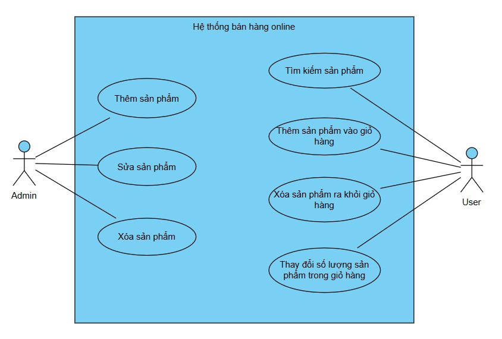

# Lab 05 – Tích hợp, Quản lý & Báo cáo

## 1. Artifacts đã xây dựng

### Use Case Diagram
Mô tả các chức năng chính của hệ thống Shopping Cart.  


### Sequence Diagram (Checkout)
Mô tả luồng tương tác khi người dùng thực hiện thanh toán.  


### Form Login (HTML/CSS/JS)
Form đăng nhập với các thành phần:
- Input: Username, Password  
- Checkbox: Remember me  
- Nút: Login, Cancel  
- Kiểm tra dữ liệu bằng JavaScript  

👉 Source code: `lab-5/artifacts/form_login.html`

---

## 2. Project Report

### 2.1 Quy trình làm việc
1. **Phân tích yêu cầu**: Xác định chức năng hệ thống.  
2. **Thiết kế UML**: Use Case & Sequence Diagram.  
3. **Hiện thực form đăng nhập** bằng HTML/CSS/JS.  
4. **Kiểm thử**: xác minh dữ liệu nhập, chỉnh sửa form.  
5. **Quản lý mã nguồn trên GitHub**: commit rõ ràng, push code, update README.  
6. **Đóng gói & phát hành**: tạo tag v1.0 để đánh dấu phiên bản ổn định.  

### 2.2 Vai trò thành viên
- **Trần Thị Thuận Kiều** – N23DCPT086: – Phân tích yêu cầu, thiết kế Use Case Diagram.  
- **Nguyễn Thị Diệp** – N23DCPT070 –: Thiết kế Sequence Diagram, hỗ trợ kiểm thử form.  
- **Lê Thị Thanh Bình** – N23DCPT063 –: Hiện thực Form Login và tích hợp lên GitHub.  

---

## 3. Hướng dẫn push & tạo tag version
```bash
# Thêm và commit thay đổi
git add .
git commit -m "Add Lab 5 report and artifacts"
git push origin main

# Tạo tag phiên bản v1.0
git tag v1.0
git push origin v1.0
