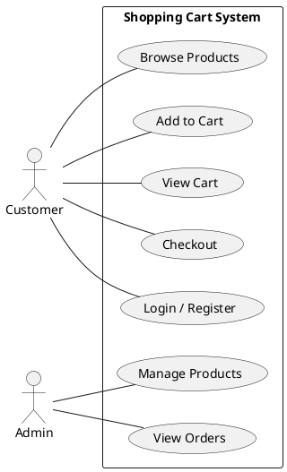
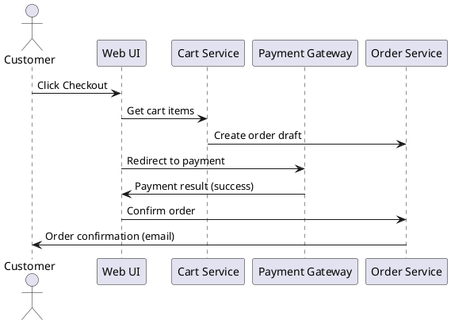

# Lab 05 – Tích hợp, quản lý và báo cáo

## Giới thiệu thành viên nhóm:  
- **Trần Thị Thuận Kiều** – N23DCPT086 – Trưởng nhóm, điều phối công việc.  
- **Lê Thị Thanh Bình** – N23DCPT063 – Phát triển giao diện và trải nghiệm người dùng.  
- **Nguyễn Thị Diệp** – N23DCPT070 – Xây dựng API và quản lý cơ sở dữ liệu.    

## Artifacts đã xây dựng
Trong quá trình làm việc, nhóm đã tạo ra một số artifacts quan trọng:  

- **Biểu đồ Use Case**: mô tả các chức năng chính của hệ thống giỏ hàng, bao gồm việc duyệt sản phẩm, thêm sản phẩm vào giỏ, đăng nhập/đăng ký, quản lý đơn hàng cho admin,...  


- **Biểu đồ Sequence (Checkout)**: mô tả dòng chảy khi người dùng thực hiện thanh toán, từ thao tác trên giao diện đến xử lý đơn hàng và xác nhận qua email.  


- **Form đăng nhập**: được xây dựng bằng HTML, CSS, JavaScript với các thành phần:  
  - Ô nhập Username và Password.  
  - Checkbox “Remember me”.  
  - Nút Login và Cancel.  
  - Kiểm tra dữ liệu cơ bản bằng JavaScript trước khi xử lý.  

Mã nguồn của form này được lưu tại `lab-5/artifacts/form_login.html`.  

## Cách nhóm thực hiện
Quá trình làm việc được triển khai theo các bước sau:  
1. Khởi tạo repository GitHub, tạo cấu trúc thư mục.  
2. Vẽ Use Case và Sequence Diagram bằng PlantUML.  
3. Phát triển form login với HTML/CSS/JS.
4. Đưa toàn bộ artifacts vào repo, viết báo cáo mô tả quy trình.  
5. Sử dụng Git để quản lý thay đổi, push code, update README và tạo bản phát hành với tag `v1.0`.  

Các công cụ chính: **Visual Studio Code, PlantUML, Git, GitHub**.  

## Cách chạy demo
- Có thể mở trực tiếp file `form_login.html` bằng trình duyệt để kiểm tra.  
- Ngoài ra có thể triển khai với **GitHub Pages** để demo online (trong Settings → Pages của repo).  

## Quản lý phiên bản với Git
Dưới đây là các lệnh Git tiêu biểu nhóm đã sử dụng:  
```bash
git add .
git commit -m "Lab05 - tích hợp UML, form login, báo cáo REPORT.md"
git push origin main

# Đặt tag v1.0 để phát hành
git tag v1.0
git push origin v1.0
```

## Kết quả đạt được
- Toàn bộ artifacts (Use Case, Sequence, Form Login) đã được xây dựng.  
- Báo cáo hoàn chỉnh (REPORT.md) mô tả rõ quy trình và kết quả.  
- Repository đã được gắn tag `v1.0`, sẵn sàng cho việc review.  

👉 Link repo: https://github.com/n23dcpt086-dotcom/Shopping_Cart.git
